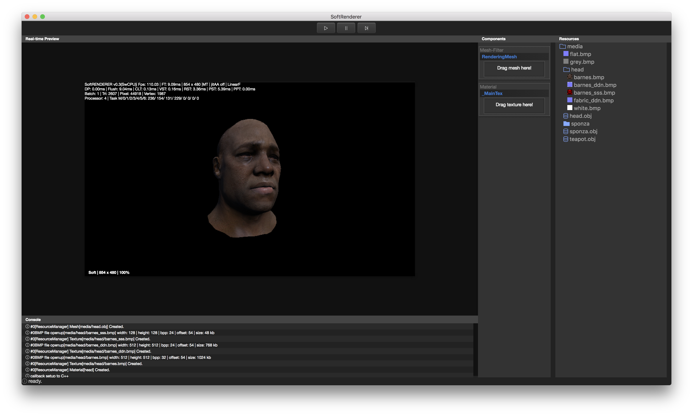

# SoftRenderer
An SoftRenderer for experiment &amp; learn.


## 重启计划2020
---
2020年，本人主体工作有部分向前端技术倾斜，故准备重新梳理softrenderer，目前electron更新了很多，原来的node-gyp已经无法编译，准备整体升级并使用typescript重写界面。

同时，老旧的代码如今看起来已经不堪一击，多年来，cpp规范也各种升级，准备在此实验一番。


### 关键实现
* 翻新数学库实现
  * SIMD优化
  * AVX2指令集
* 多线程模型升级
  * 减少同步锁
  * 科学的任务派发机制
* 应用层优化
  * 更多node-gyp绑定
  * typescript支持
  * 在应用层通过typescript控制更多逻辑

<br>

## 重启计划2018
---
2018年，重启softrender工程，旨在重新回归本源，并且将一些新技术应用起来，同时依时间情况构建一系列软渲染教程

### 关键实现
* 跨平台实现
  * 脱离winapi, 更加现代
  * 得以在移动平台运行
* electron & node.js & node-gyp的技术栈 
  * 在跨平台的基础上，保留完整的原生性能
  * 脱离具体的图形api
* 软件结构简化，代码结构梳理
  * 更加方便后来者学习
  * 更加方便后续构建课程

<br>

## 部署

#### ubuntu

```shell
# 安装依赖
sudo apt install npm
sudo apt install ubuntu-make

# npm初始化
npm install

# 编译native addon
npm run nconfig
npm run nbuild

# 运行
npm start
```

#### mac

确保安装了node, 直接下载pkg或通过brew安装
确保安装了xcode以及已经应用xcode command tools

```shell
# npm初始化
npm install
npm install -g node-gyp

# 编译native addon
npm run nconfig
npm run nbuild

# 运行
npm start
```

#### windows

确保安装了node, 
确保安装visual studio的cpp编译环境
根据node-gyp要求，c:\python27这个位置需要有python的二进制

```shell
# 安装node-gyp
npm install --global node-gyp@latest
npm prefix -g | % {npm config set node_gyp "$_\node_modules\node-gyp\bin\node-gyp.js"}

# npm初始化
npm install

# 编译native addon
npm run nconfig
npm run nbuild

# 运行
npm start
```
